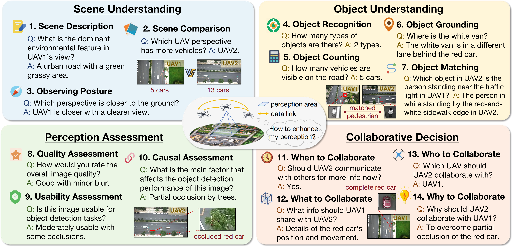
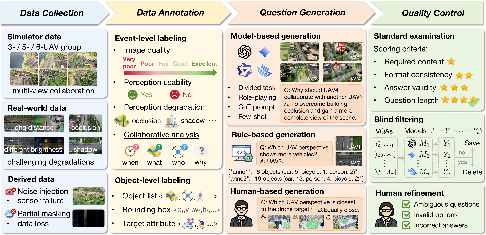
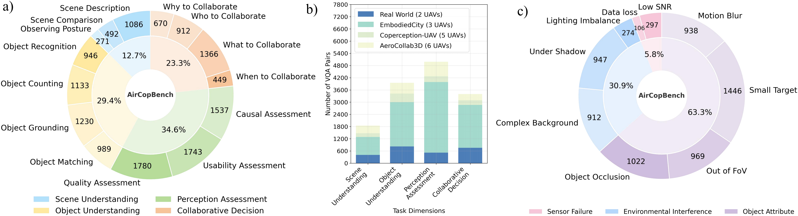

# AirCopBench: A Benchmark for Multi-drone Collaborative Embodied Perception and Reasoning

The benchmark is designed to evaluate whether Multimodal Large Language Models (MLLMs) can process multi-UAV collaborative visual data for question answering, covering perception, reasoning, and decision-making in perception degradation scenarios.

- **Paper**: https://arxiv.org/pdf/2511.11025
- **Project**: https://embodiedcity.github.io/AirCopBench/
- **Dataset**: https://huggingface.co/datasets/EasonFan/AirCopBench/tree/main

---

## News
- 🎉 Our paper has been accepted by AAAI 2026!
- ✅ All datasets, code, and supplementary material released
- ✅ Unified question generation pipeline for 14 tasks
- ✅ One-click integration script for interactive VQA generation

---

## Dataset Features

- 💡 **Central Contribution**: The **first** comprehensive benchmark focusing on multi-UAV collaborative embodied perception and reasoning, including over 2.9k multi-view images and over 14.6k Visual Question Answering (VQA) pairs.
- 🔄 **Varied Data Sources**: simulator data (with 3, 5, and 6 observing UAVs), real-world data (with 2 observing UAVs), and derived data for noisy and loss scenarios.
- 📋 **Rich Task Definition**: 4 main task dimensions and 14 subtasks covering collaborative perception, understanding, and reasoning.
- 🌫️ **Various Perception Degradation**: occlusion, shadow, lighting imbalance, long distance, out of FoV, noise, data loss, and motion blur.
- 🎯 **Diverse Target Types**: vehicles, drones, pedestrians, and bicycles.
- 🧩 **Multiple Modalities**: RGB images, text, and point cloud.

---

## Task Definition

AirCopBench encompasses four core task dimensions: Scene Understanding, Object Understanding, Perception Assessment, and Collaborative Decision. These are further segmented into sub-tasks, enabling a more granular assessment of collaborative perception and reasoning capabilities.

<p align="center">
  
</p>

- **Scene Understanding (SU)**
  - `scene_description`: interpret and understand scenes from images
  - `scene_comparison`: compare different scenes
  - `observing_posture`: analyze camera posture
- **Object Understanding (OU)**
  - `object_recognition`: identify objects in images
  - `object_counting`: count number of objects
  - `object_grounding`: locate objects in images
  - `object_matching`: match objects across different views
- **Perception Assessment (PA)**
  - `quality_assessment`: evaluate image quality
  - `usability_assessment`: assess usefulness for target perception tasks
  - `causal_assessment`: reason about reasons for perception degradation
- **Collaborative Decision (CD)**
  - `when_to_collaborate`: identify when collaboration is essential for current UAV (temporal decision)
  - `what_to_collaborate`: determine the information that should be shared between UAVs (content selection)
  - `who_to_collaborate`: assess which UAVs are best suited for collaboration (agent selection)
  - `why_to_collaborate`: explore the reasons for required information exchange among UAVs (reasoning for collaboration)

---

## Dataset Generation Pipeline

AirCopBench generation pipeline includes 4 main steps: Data Collection, Data Annotation, Question Generation, and Quality Control. This systematic approach ensures the validity and high quality of the generated dataset.

<p align="center">
  
</p>

### VQA Generation

#### Quick Start

##### 1. Install Dependencies

```bash
# Main project dependencies
pip install -r requirements.txt

# Simulator collection dependencies
cd Data_Collection/Simulator_Collection/EmbodiedCity_Collection
pip install -r requirements.txt
```

##### 2. Configure OpenAI API Key

```bash
export OPENAI_API_KEY=your_api_key
```

##### 3. Run the VQA generation script

```bash
python integrated_vqa.py
```
- Follow the prompts to select dataset, task, and subtask.
- Results will be saved as JSON files in the current directory.

##### 4. Advanced Configuration Options

###### API Configuration Optimization

```python
# Set detailed API configuration in scripts
import openai

openai.api_key = "your_api_key"
openai.api_base = "https://api.openai.com/v1"  # Optional: custom API endpoint
openai.timeout = 60  # Set timeout (seconds)
```

###### Batch Processing Configuration

```bash
# Batch process multiple datasets
python integrated_vqa.py --batch --datasets Sim3,Sim5,Sim6,Real2 --tasks CD,OU,PA,SU
```

###### Output Format Configuration

```bash
# Specify output format and path
python integrated_vqa.py --output-format json --output-dir ./results
```

#### Running a Single VQA Generation Script

You can also run any original task script directly (e.g. Sim3_CD.py, Real2_OU.py):

```bash
cd VQA_Generation/VQA_Sim3
python Sim3_CD.py
```
- All scripts use relative paths based on `datasets/`. No need to edit paths.
- Results are saved as JSON files in the script directory.

---

## Project Structure

```
AirCopBench/
├── Data_Collection/                    # Data collection module
│   ├── Derived_Collection/             # Image post-processing tools
│   │   ├── apply_noise_to_image.py    # Image noise addition
│   │   └── export_to_excel.py         # JSON to Excel export
│   └── Simulator_Collection/           # Simulator data collection
│       └── EmbodiedCity_Collection/    # EmbodiedCity simulator collection
│           ├── main.py                 # Main collection script
│           ├── config.py               # Configuration parsing
│           ├── uav_manager.py          # UAV management
│           ├── motion.py               # Motion pattern definitions
│           ├── recorder.py             # Video recording
│           ├── manual_trajectory_recorder.py  # Manual trajectory recording
│           ├── print_point.py          # Point viewing tool
│           ├── scenarios/              # Scenario configuration files
│           ├── requirements.txt        # Dependencies
│           └── utils.py                # Utility functions
├── Data_Annotation/                    # Data annotation module
│   ├── Real2_Sample.json              # Real2 dataset annotation example
│   ├── Sim3_Sample.json               # Sim3 dataset annotation example
│   ├── Sim5_Sample.json               # Sim5 dataset annotation example
│   └── Sim6_Sample.json               # Sim6 dataset annotation example
├── VQA_Generation/                     # VQA generation module
│   ├── integrated_vqa.py              # Integrated VQA generation script
│   ├── VQA_Sim3/                      # Sim3 VQA generation
│   ├── VQA_Sim5/                      # Sim5 VQA generation
│   ├── VQA_Sim6/                      # Sim6 VQA generation
│   └── VQA_Real2/                     # Real2 VQA generation
├── AirCopBench_evaluation/            # Evaluation Code for AirCopBench
│   ├── evaluation.py                  # Evaluation code example using gpt-4o
├── AirCopBench_sft/                   # Configuration of SFT on AirCopBench
│   ├── llava13b_vqa_sft.yaml          # Configuration for fine-tuning llava-next-13b
│   ├── qwen2_5vl_lora_sft.yaml        # Configuration for fine-tuning qwen-2.5-vl/qwen-2-vl
├── requirements.txt                    # Main project dependencies
└── README.md                          # Project documentation
```

## Dataset Satistics

AirCopBench comprises 2,920 simultaneous multi-view images with various challenging perception degradation collected from real world and simulators, as shown in Fig.b&c. The dataset includes 14,610 questions, including both basic tasks like scene and object understanding, as well as advanced tasks like perception assessment and collaborative decision, as detailed in Fig.a. 

<p align="center">
  
</p>

---

## Data Collection

### Image Post-processing (Derived_Data)

#### Image Noise Addition

```bash
cd Data_Collection/Derived_Collection
python apply_noise_to_image.py
```

#### JSON to Excel Export

```bash
cd Data_Collection/Derived_Collection
python export_to_excel.py
```


## Training and Evaluation

### Training
  Please refer to [LLaMA-Factory](https://github.com/hiyouga/LLaMA-Factory).

### Evaluation
  We have offered an example code using gpt-4o to conduct evaluation on our benchmark.
```bash
python AirCopBench_evaluation/evaluation.py # remember to set the api and dataset path in the code.
```


## Acknowledgements

Thanks to all contributors and the open-source community for inspiration and support.


## Citation

If you use this project in your research, please cite the following paper:

```bibtex
@article{zha2025aircopbench,
  title={AirCopBench: A Benchmark for Multi-drone Collaborative Embodied Perception and Reasoning},
  author={Zha, Jirong and Fan, Yuxuan and Zhang, Tianyu and Chen, Geng and Chen, Yingfeng and Gao, Chen and Chen, Xinlei},
  journal={arXiv preprint arXiv:2511.11025},
  year={2025}
}


